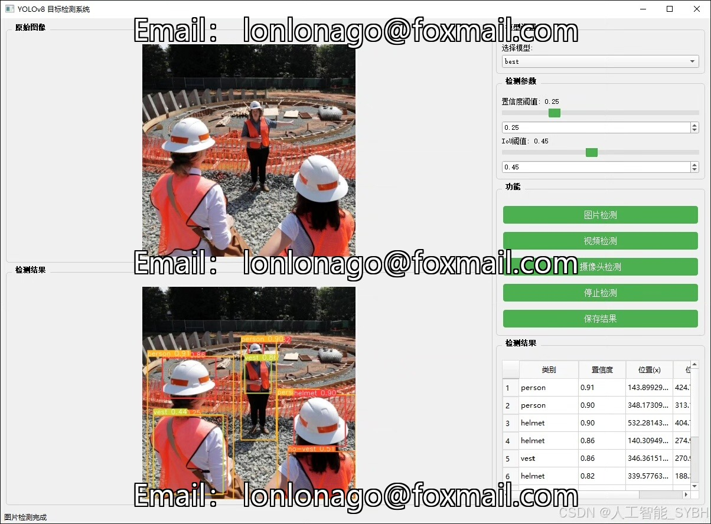
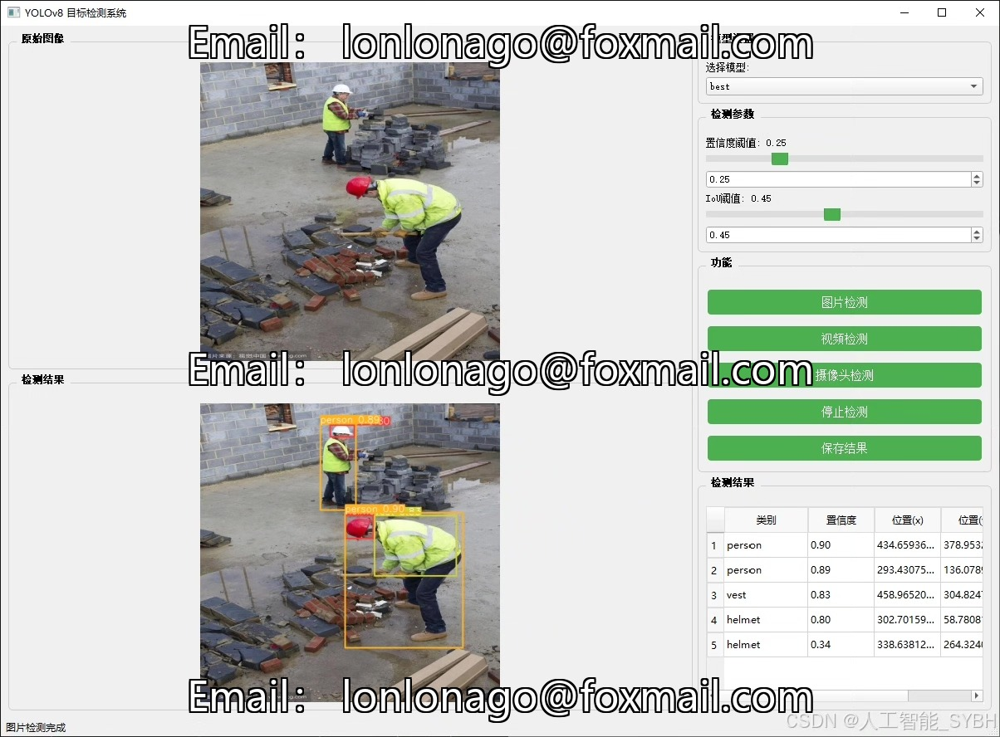
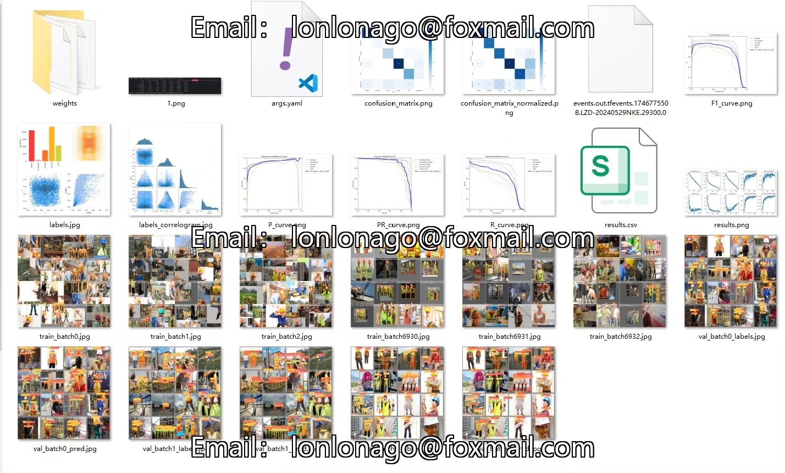
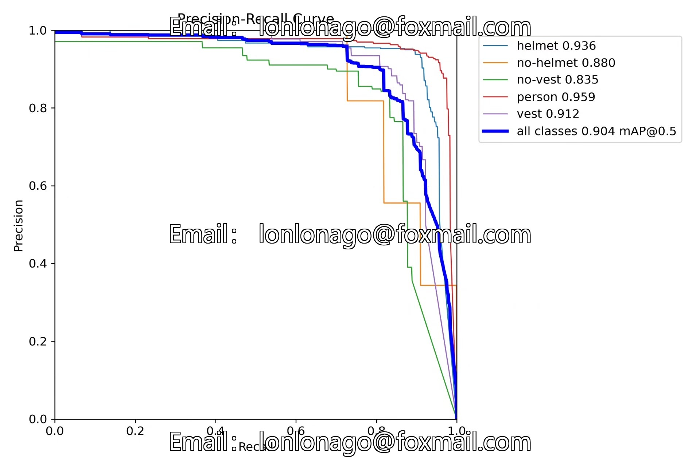
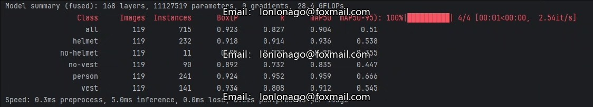
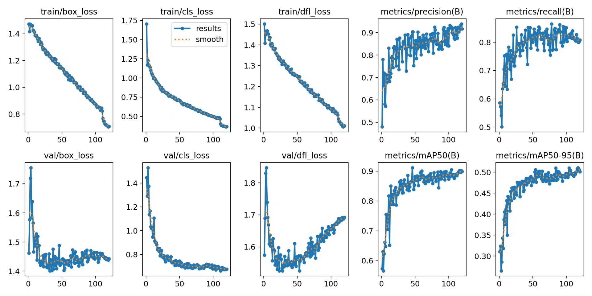
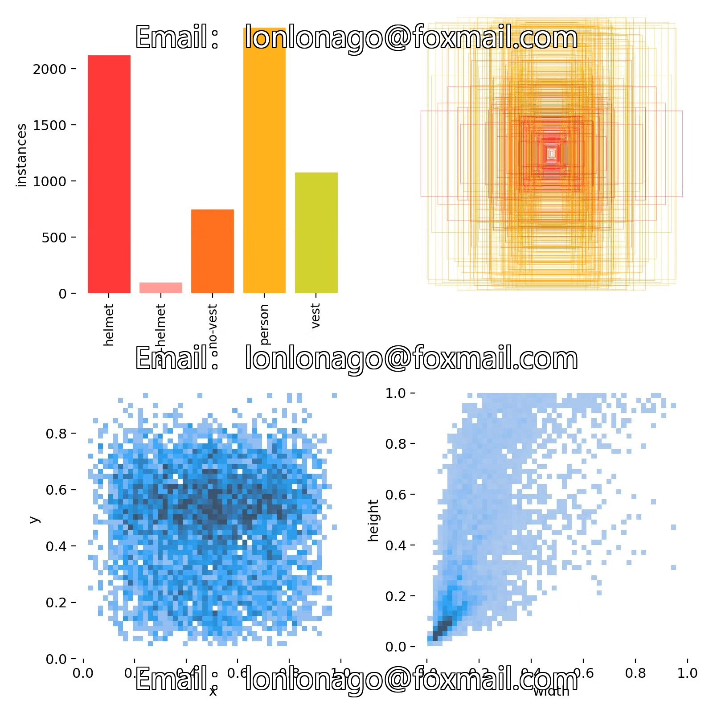
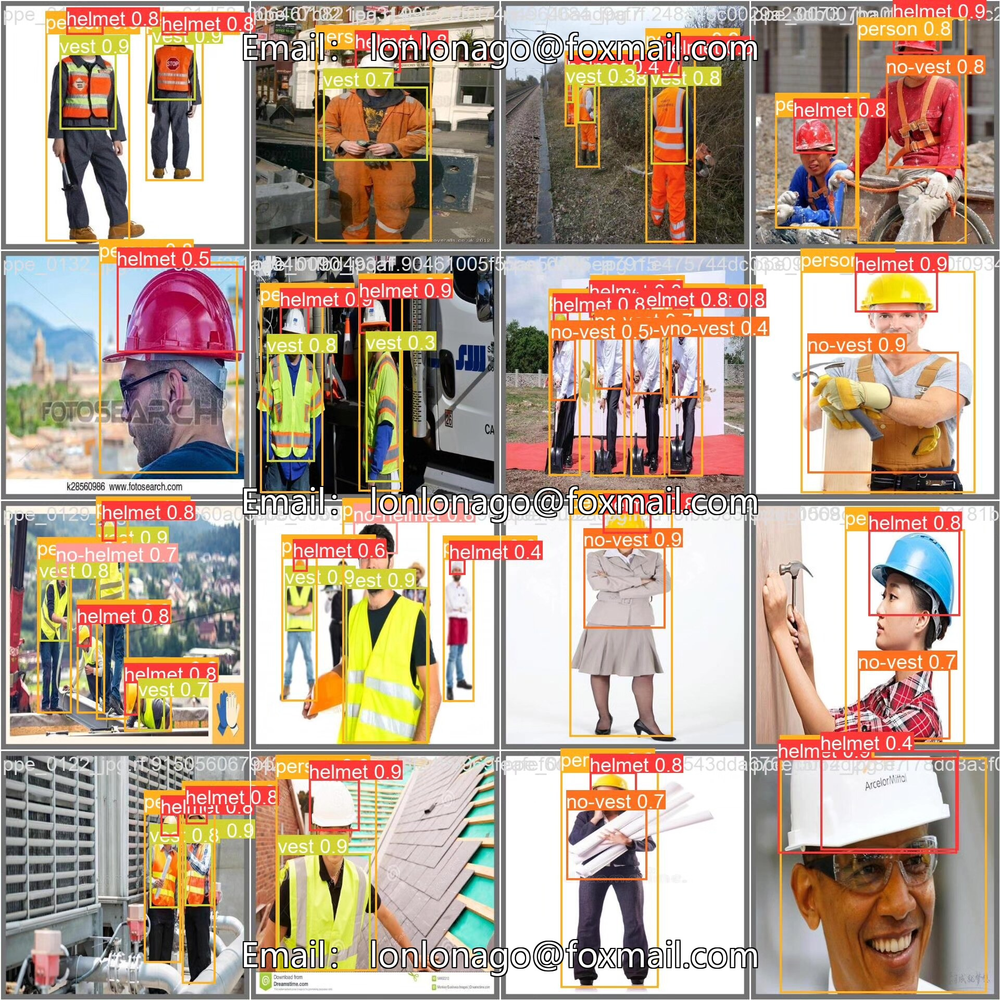

# Based on deep learning YOLOv8, the construction site safety helmet and protective clothing detection system (YOLO)

## Body

Based on the YOLOv8 object detection algorithm, a smart detection system for construction site safety management has been developed. It can identify and detect whether workers are wearing safety helmets and protective clothing in real-time. The system uses a five-classification detection model (nc=5) to accurately recognize 'helmet' (safety helmet), 'no-helmet', 'no-vest', 'person', and 'vest' as the target categories. The project uses a dataset containing 1,206 labeled images for training and evaluation, with 997 training images, 119 validation images, and 90 test images. This system can be deployed on construction site surveillance cameras or mobile devices to achieve uninterrupted automatic safety monitoring 24 hours a day, significantly improving the efficiency and accuracy of construction site safety management and reducing the risk of accidents caused by human errors.

The company's products have obtained YOLO official commercial license certification.

We provide after-sales service.

After payment, we will provide WeChat IDs for instant questions and answers.

Environmental configuration: We will provide an instruction manual for setting up the environment, and WeChat will provide答疑.

Remote installation services: If you need remote configuration, an additional fee of 69 is required,
failure in configuration will result in all fees being refunded (only installation fees for older computers).

Retraining dataset: After setting up the environment, you can train on your own computer.
If you need us to retrain, just pay 69 + computing power fees (2.5 yuan/hour).

Full after-sales service

## Images

## Payment

Here is a pay link on Stripe ( https://buy.stripe.com/3cs8yP7sY87d0vu9AB ). Please contact me lonlonago@foxmail.com after funding $89, and I will send you a complete data files , thank you!

